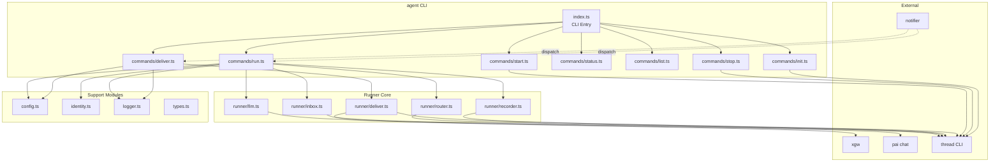

# 设计文档：Agent Runtime

## 概述

Agent Runtime 是 TheClaw 平台的 agent 生命周期管理与运行时模块。它以 CLI 工具形式提供，通过 commander 框架解析命令，驱动 agent 的创建、启动、停止和核心运行循环。

核心设计原则：
- **Agent 即目录**：每个 agent 的全部状态存放在 `~/.theclaw/agents/<agent_id>/` 下，目录名即 agent_id
- **无常驻进程**：agent 不是 daemon，而是由 `notifier` 通过 thread dispatch 机制按需调度
- **工具链组合**：LLM 调用通过 `pai chat`，事件队列通过 `thread`，出站投递通过 `xgw send`
- **文件锁保证串行**：同一 agent 的 `run` 不并发执行

## 架构



数据流：
1. 外部消息通过 `xgw` → `thread push` 写入 agent inbox
2. `notifier` 检测到新消息，通过 `thread dispatch` 触发 `agent run <id>`
3. `agent run` 从 inbox `thread pop` 消费消息，路由到目标 thread
4. 组装 context，调用 `pai chat` 获取 LLM 回复
5. 回复写入 thread，outbound consumer 被 dispatch 触发 `agent deliver`
6. `agent deliver` 从 thread pop 回复事件，通过 `xgw send` 或 `thread push` 投递

## 组件与接口

### CLI 入口 (`src/index.ts`)

使用 commander 注册所有子命令，统一处理 `--json` 全局选项。

```typescript
// src/index.ts
import { Command } from 'commander';

const program = new Command('agent')
  .description('Agent runtime and lifecycle management')
  .version('0.1.0');

program.command('init <id>').option('--kind <kind>', 'system | user', 'user').action(initCmd);
program.command('start <id>').action(startCmd);
program.command('stop <id>').action(stopCmd);
program.command('status [id]').option('--json', 'JSON output').action(statusCmd);
program.command('list').option('--json', 'JSON output').action(listCmd);
program.command('run <id>').action(runCmd);
program.command('deliver').option('--thread <path>').option('--consumer <name>').action(deliverCmd);

program.parse();
```

### 命令模块 (`src/commands/`)

每个子命令一个文件，导出 async action 函数。

#### `init.ts`

```typescript
export async function initCmd(id: string, opts: { kind: string }): Promise<void> {
  // 1. 检查 agent 目录是否已存在
  // 2. 创建目录结构: inbox/, sessions/, memory/, threads/{peers,sessions,main}, workdir/, logs/
  // 3. 生成默认 IDENTITY.md, USAGE.md, config.yaml
  // 4. 执行 thread init 初始化 inbox
}
```

#### `start.ts`

```typescript
export async function startCmd(id: string): Promise<void> {
  // 1. 加载 config
  // 2. thread subscribe --thread <inbox_path> --consumer inbox --handler "agent run <id>"
  // 3. 记录启动日志
}
```

#### `stop.ts`

```typescript
export async function stopCmd(id: string): Promise<void> {
  // 1. thread unsubscribe --thread <inbox_path> --consumer inbox
}
```

#### `run.ts`

```typescript
export async function runCmd(id: string): Promise<void> {
  // 1. 获取文件锁 (run.lock)
  // 2. 加载 config, identity
  // 3. inbox.consumeMessages() — thread pop
  // 4. 对每条消息: router.route() → recorder.pushMessage() → llm.invoke() → recorder.pushReply()
  // 5. 注册 outbound consumer (如果是新 thread)
  // 6. 更新 inbox 消费进度
  // 7. 释放文件锁
}
```

#### `deliver.ts`

```typescript
export async function deliverCmd(opts: { thread: string; consumer: string }): Promise<void> {
  // 1. thread pop --consumer outbound 取出待投递 events
  // 2. 解析 reply_context
  // 3. external → xgw send, internal → thread push
  // 4. 失败处理: 不 ACK, 超过 max_attempts 写 error record
}
```

### Runner 核心模块 (`src/runner/`)

#### `inbox.ts` — Inbox 消费

```typescript
export interface InboxMessage {
  eventId: string;
  type: string;
  source: string;
  content: Record<string, unknown>;
  timestamp: string;
}

export async function consumeMessages(
  inboxPath: string,
  consumerId: string,
  lastEventId?: string
): Promise<InboxMessage[]> {
  // 执行: thread pop --thread <inboxPath> --consumer <consumerId> [--last-event-id <lastEventId>]
  // 解析 JSON 输出为 InboxMessage[]
  // 返回空数组表示无新消息
}
```

#### `router.ts` — 消息路由

```typescript
export type RoutingMode = 'per-peer' | 'per-channel' | 'per-agent';

export interface RouteResult {
  threadPath: string;
  isNew: boolean;  // 是否新创建的 thread
}

export function resolveThreadPath(
  agentDir: string,
  mode: RoutingMode,
  channelId: string,
  peerId: string
): string {
  // per-peer  → <agentDir>/threads/peers/<channelId>-<peerId>/
  // per-channel → <agentDir>/threads/channels/<channelId>/
  // per-agent → <agentDir>/threads/main/
}

export async function routeMessage(
  agentDir: string,
  mode: RoutingMode,
  channelId: string,
  peerId: string
): Promise<RouteResult> {
  // 1. resolveThreadPath 计算目标路径
  // 2. 检查目录是否存在
  // 3. 不存在则 thread init 创建
  // 4. 返回 { threadPath, isNew }
}
```

#### `llm.ts` — LLM 调用

```typescript
export interface LlmInvokeParams {
  sessionFile: string;
  systemPromptFile: string;
  provider: string;
  model: string;
  userMessage: string;
}

export interface LlmResult {
  reply: string;
  toolCalls?: ToolCall[];
}

export async function invokeLlm(params: LlmInvokeParams): Promise<LlmResult> {
  // 执行: pai chat --session <sessionFile> --system-file <systemPromptFile>
  //       --provider <provider> --model <model> "<userMessage>"
  // 解析 stdout 为 LlmResult
}
```

#### `recorder.ts` — 事件记录

```typescript
export async function pushMessage(
  threadPath: string,
  source: string,
  content: Record<string, unknown>
): Promise<string> {
  // thread push --thread <threadPath> --type message --source <source> --content <JSON>
  // 返回 event_id
}

export async function pushRecord(
  threadPath: string,
  subtype: string,
  source: string,
  content: Record<string, unknown>
): Promise<string> {
  // thread push --thread <threadPath> --type record --subtype <subtype> --source <source> --content <JSON>
}

export async function pushError(
  threadPath: string,
  errorInfo: { error: string; context?: string }
): Promise<string> {
  // pushRecord(threadPath, 'error', 'self', errorInfo)
}
```

#### `deliver.ts` — 出站投递

```typescript
export interface DeliveryEvent {
  eventId: string;
  content: {
    text: string;
    reply_context: ReplyContext;
  };
}

export interface ReplyContext {
  channel_type: 'external' | 'internal';
  channel_id: string;
  peer_id: string;
  session_id?: string;
  visibility?: string;
  source_agent_id?: string;  // internal 来源时，发送方 agent id
}

export async function deliverBatch(
  threadPath: string,
  consumerName: string,
  maxAttempts: number
): Promise<void> {
  // 1. thread pop 取出 events
  // 2. 对每条 event:
  //    - 解析 reply_context
  //    - external → execXgwSend(event)
  //    - internal → execThreadPush(event)
  //    - 失败 → 不 ACK, 记录重试次数
  //    - 超过 maxAttempts → pushError + 跳过
}
```

### 支持模块

#### `config.ts` — 配置加载

```typescript
export interface AgentConfig {
  agent_id: string;
  kind: 'system' | 'user';
  pai: { provider: string; model: string };
  inbox: { path: string };
  routing: { default: RoutingMode };
  outbound: Array<{ thread_pattern: string; via: string }>;
  retry?: { max_attempts?: number };
  deliver?: { max_attempts?: number };
}

export async function loadConfig(agentDir: string): Promise<AgentConfig> {
  // 读取 config.yaml, 解析, 填充默认值
  // routing.default 默认 'per-peer'
  // retry.max_attempts 默认 3
  // deliver.max_attempts 默认 3
}
```

#### `identity.ts` — Identity 加载与 System Prompt 组装

```typescript
export async function loadIdentity(agentDir: string): Promise<string> {
  // 读取 IDENTITY.md 内容
}

export async function buildSystemPrompt(
  agentDir: string,
  peerId?: string,
  threadId?: string
): Promise<string> {
  // 1. 读取 IDENTITY.md
  // 2. 读取 memory/agent.md (如果存在)
  // 3. 读取 memory/user-<peerId>.md (如果存在)
  // 4. 读取 memory/thread-<threadId>.md (如果存在)
  // 5. 组装: identity + agent memory + user memory + thread memory
}
```

#### `logger.ts` — 日志

```typescript
export interface Logger {
  info(msg: string): void;
  error(msg: string): void;
  debug(msg: string): void;
}

export function createLogger(agentDir: string): Logger {
  // 写入 <agentDir>/logs/agent.log
  // 超过 10000 行自动轮换
}
```

#### `types.ts` — 共享类型

```typescript
export interface InboxMessage { /* ... */ }
export interface ReplyContext { /* ... */ }
export interface ToolCall { name: string; arguments: Record<string, unknown>; result?: string; }
export type RoutingMode = 'per-peer' | 'per-channel' | 'per-agent';
```

## 数据模型

### Agent 目录结构

```
~/.theclaw/agents/<agent_id>/
├── IDENTITY.md
├── USAGE.md
├── config.yaml
├── run.lock                    # 文件锁，防止并发 run
├── inbox/                      # thread 目录
├── sessions/<thread_id>.jsonl  # pai chat session 文件
├── memory/
│   ├── agent.md
│   ├── user-<peer_id>.md
│   └── thread-<thread_id>.md
├── threads/
│   ├── peers/<channel_id>-<peer_id>/
│   ├── channels/<channel_id>/
│   └── main/
├── workdir/
└── logs/agent.log
```

### config.yaml 数据模型

```yaml
agent_id: string          # agent 标识符
kind: system | user       # agent 类型

pai:
  provider: string        # LLM provider (e.g. openai)
  model: string           # LLM model (e.g. gpt-4o)

inbox:
  path: string            # inbox thread 目录的绝对路径

routing:
  default: per-peer | per-channel | per-agent

outbound:
  - thread_pattern: string  # glob 模式匹配 thread
    via: string             # 投递方式 (xgw)

retry:
  max_attempts: number      # 可恢复错误最大重试次数，默认 3

deliver:
  max_attempts: number      # 出站投递最大重试次数，默认 3
```

### InboxMessage 数据模型

```typescript
interface InboxMessage {
  eventId: string;        // thread 分配的事件 ID
  type: 'message';        // 事件类型
  source: string;         // 来源地址 (e.g. "xgw:telegram:user123" 或 "internal:admin")
  content: {
    text: string;         // 消息文本
    reply_context: ReplyContext;  // 出站路由信息（透传）
    [key: string]: unknown;
  };
  timestamp: string;      // ISO 8601 时间戳
}
```

### ReplyContext 数据模型

```typescript
interface ReplyContext {
  channel_type: 'external' | 'internal';
  channel_id: string;       // 渠道 ID
  peer_id: string;          // 对端 ID
  session_id?: string;      // 会话 ID（可选）
  visibility?: string;      // 可见性（可选）
  source_agent_id?: string; // internal 来源时，发送方 agent ID
}
```

### Thread 路由映射

| RoutingMode | Thread Path Pattern | 说明 |
|---|---|---|
| `per-peer` | `threads/peers/<channel_id>-<peer_id>/` | 每个 (channel, peer) 独立 thread |
| `per-channel` | `threads/channels/<channel_id>/` | 同一渠道共享 thread |
| `per-agent` | `threads/main/` | 所有消息共享一个 thread |


## 正确性属性（Correctness Properties）

*正确性属性是一种在系统所有有效执行中都应成立的特征或行为——本质上是关于系统应该做什么的形式化陈述。属性是人类可读规范与机器可验证正确性保证之间的桥梁。*

### Property 1: Thread 路径解析正确性

*For any* routing mode（per-peer、per-channel、per-agent）、任意 channel_id 和 peer_id，`resolveThreadPath` 函数应返回符合对应模式的路径：
- per-peer → `threads/peers/<channel_id>-<peer_id>/`
- per-channel → `threads/channels/<channel_id>/`
- per-agent → `threads/main/`

**Validates: Requirements 4.3, 5.1, 5.2, 5.3**

### Property 2: Source 地址透传

*For any* 入站消息，当 Run_Loop 将其写入目标 thread 时，写入的 source 字段应与原始入站消息的 source 字段完全相同。

**Validates: Requirements 4.4**

### Property 3: Reply Context 透传

*For any* agent 回复消息，写入 thread 的 content 中应包含原始入站消息的 reply_context，且 reply_context 的所有字段值不变。

**Validates: Requirements 6.3**

### Property 4: System Prompt 组装完整性

*For any* agent 目录中存在的 memory 文件组合（agent.md、user-\<peer_id\>.md、thread-\<thread_id\>.md），`buildSystemPrompt` 的输出应包含 IDENTITY.md 的内容，且按顺序包含所有存在的 memory 层内容。

**Validates: Requirements 4.5, 8.1, 8.3**

### Property 5: Session 文件路径一致性

*For any* agent_id 和 thread_id，LLM 调用使用的 session 文件路径应为 `<agent_dir>/sessions/<thread_id>.jsonl`。

**Validates: Requirements 6.1**

### Property 6: 出站投递路由正确性

*For any* 待投递 event，当 reply_context.channel_type 为 `external` 时应选择 `xgw send` 投递方式，当为 `internal` 时应选择 `thread push` 写入发送方 agent 的 inbox。

**Validates: Requirements 7.2, 7.3**

### Property 7: 配置默认值填充

*For any* 缺少可选字段的 config.yaml 内容，`loadConfig` 应返回填充了正确默认值的 AgentConfig 对象（routing.default = 'per-peer'，retry.max_attempts = 3，deliver.max_attempts = 3）。

**Validates: Requirements 9.2**

### Property 8: 配置解析 Round-Trip

*For any* 有效的 AgentConfig 对象，将其序列化为 YAML 再解析回来应产生等价的 AgentConfig 对象。

**Validates: Requirements 9.1**

### Property 9: 可恢复错误重试上限

*For any* 可恢复错误场景，重试次数不应超过 config 中配置的 max_attempts 值，且重试间隔应遵循指数退避模式。

**Validates: Requirements 11.1**

### Property 10: 不可恢复错误不重试

*For any* 不可恢复错误场景，Run_Loop 不应执行重试，应写入一条 error record 事件，然后继续处理下一条消息。

**Validates: Requirements 11.2**

### Property 11: 错误输出格式一致性

*For any* 错误信息，非 JSON 模式下应匹配 `Error: <描述> - <建议>` 格式输出到 stderr；JSON 模式下应输出包含 `error` 和 `suggestion` 字段的有效 JSON。

**Validates: Requirements 11.4, 11.5**

### Property 12: 日志轮换

*For any* 日志文件，当行数超过 10000 行后执行写入操作时，Logger 应将旧日志轮换为带时间戳的归档文件，并创建新的日志文件。

**Validates: Requirements 12.2**

### Property 13: 文件锁互斥

*For any* 两个并发的 `agent run` 尝试，同一时刻最多只有一个能成功获取文件锁并执行。

**Validates: Requirements 4.10**

### Property 14: Memory 压缩触发

*For any* context 大小超过 token 阈值的情况，Run_Loop 应在调用 `pai chat` 前先执行 memory 压缩。

**Validates: Requirements 8.4**

## 错误处理

### 错误分类

| 类别 | 示例 | 处理策略 |
|------|------|---------|
| 可恢复错误 | 网络超时、LLM API 临时错误、rate limit | 指数退避重试，最多 `retry.max_attempts` 次 |
| 不可恢复错误 | 配置错误、认证失败、LLM 策略违反 | 不重试，写 error record，继续下一条消息 |
| 批次级致命错误 | inbox 不可访问、文件锁获取失败 | 直接退出，exit code 1 |
| CLI 用法错误 | 无效命令、缺少参数 | 显示帮助，exit code 2 |

### 错误输出格式

- 人类模式（默认）：`Error: <what went wrong> - <how to fix>` → stderr
- JSON 模式（`--json`）：`{"error": "...", "suggestion": "..."}` → stdout

### 重试机制

```typescript
async function withRetry<T>(
  fn: () => Promise<T>,
  maxAttempts: number,
  isRecoverable: (err: Error) => boolean
): Promise<T> {
  for (let attempt = 1; attempt <= maxAttempts; attempt++) {
    try {
      return await fn();
    } catch (err) {
      if (!isRecoverable(err as Error) || attempt === maxAttempts) throw err;
      await sleep(Math.pow(2, attempt) * 100); // 指数退避: 200ms, 400ms, 800ms...
    }
  }
  throw new Error('unreachable');
}
```

## 测试策略

### 测试框架

- 单元测试与属性测试均使用 vitest
- 属性测试库：fast-check
- 目录结构遵循项目约定：`vitest/unit/`（单元测试）、`vitest/pbt/`（属性测试），均为扁平结构

### 单元测试

单元测试覆盖具体示例、边界情况和集成点：

- `vitest/unit/config.test.ts` — 配置加载、默认值、错误处理
- `vitest/unit/router.test.ts` — 路由路径解析、thread 创建
- `vitest/unit/identity.test.ts` — IDENTITY.md 加载、system prompt 组装
- `vitest/unit/deliver.test.ts` — 出站投递路由、重试逻辑
- `vitest/unit/logger.test.ts` — 日志写入、轮换
- `vitest/unit/init.test.ts` — agent 初始化、目录创建
- `vitest/unit/error-handling.test.ts` — 错误分类、格式化

### 属性测试

每个属性测试对应设计文档中的一个正确性属性，最少运行 100 次迭代：

- `vitest/pbt/thread-routing.pbt.test.ts` — Property 1: Thread 路径解析
- `vitest/pbt/message-forwarding.pbt.test.ts` — Property 2 & 3: Source 和 ReplyContext 透传
- `vitest/pbt/system-prompt.pbt.test.ts` — Property 4: System Prompt 组装
- `vitest/pbt/config-roundtrip.pbt.test.ts` — Property 7 & 8: 配置默认值与 Round-Trip
- `vitest/pbt/delivery-routing.pbt.test.ts` — Property 6: 出站投递路由
- `vitest/pbt/error-format.pbt.test.ts` — Property 11: 错误输出格式
- `vitest/pbt/log-rotation.pbt.test.ts` — Property 12: 日志轮换

每个属性测试必须包含注释标记：
```typescript
// Feature: agent-runtime, Property 1: Thread 路径解析正确性
```

### 测试命名约定

- 单元测试：`<module-name>.test.ts`
- 属性测试：`<topic>.pbt.test.ts`
- 不在 `unit/` 或 `pbt/` 下创建子目录
